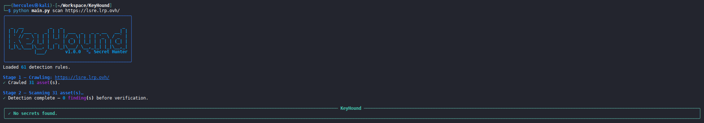
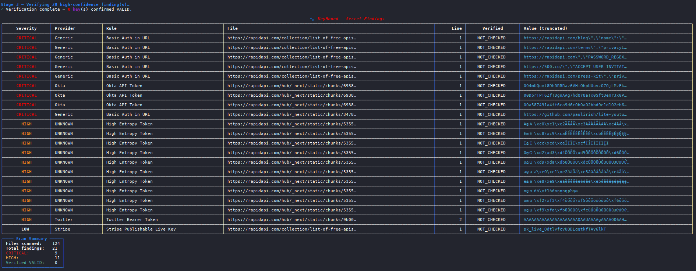

# KeyHound 🐾

> **3-stage secret detection pipeline for frontend assets**

[](https://python.org)
[](LICENSE)
[]()

KeyHound crawls a target URL and hunts for leaked secrets — API keys, tokens, private keys, and connection strings — hidden in JavaScript bundles, inline scripts, Webpack chunks, and JSON endpoints.

---

## Pipeline Overview

```
Stage 1: Crawl    →  Discovers JS files, inline scripts, JSON endpoints, Webpack chunks
Stage 2: Detect   →  60+ regex rules + Shannon entropy analysis
Stage 3: Verify   →  Live API probing (AWS, GitHub, Stripe, Twilio, SendGrid, Slack)
         Report   →  Rich terminal table · JSON file · Self-contained HTML report
```

---

## Screenshots

### Scan Progress & Clean Run


### Findings Table & Scan Summary


---

## Installation

```bash
git clone https://github.com/yourname/keyhound.git
cd keyhound
pip install -r requirements.txt
```

---

## Usage

### Scan a live URL (full pipeline)

```bash
python main.py scan https://target.example.com
```

### Common flags

```bash
# Skip live API verification
python main.py scan https://target.example.com --no-verify

# Save JSON + HTML reports
python main.py scan https://target.example.com --json --html

# Slower crawl delay + deeper chunk discovery
python main.py scan https://target.example.com --delay 1.5 --depth 2

# Use a custom rules file
python main.py scan https://target.example.com --custom-rules my_rules.yaml
```

### Scan a local file

```bash
python main.py file path/to/bundle.js
python main.py file path/to/app.html --html
```

### List all loaded rules

```bash
python main.py rules
```

### Version

```bash
python main.py --version
```

---

## Detection Engine

### Regex Rules (60+ patterns)

Located in `rules/secrets.yaml`. Each rule has:

| Field      | Description                          |
|------------|--------------------------------------|
| `name`     | Human-readable rule name             |
| `provider` | Service/provider (AWS, GitHub, etc.) |
| `severity` | `CRITICAL` / `HIGH` / `LOW`          |
| `regex`    | Python regex pattern                 |

Providers covered: AWS, GitHub, GitLab, Google, GCP, Azure, DigitalOcean, Stripe, PayPal, Square, Coinbase, Twilio, SendGrid, Mailgun, Slack, Discord, npm, Heroku, HubSpot, Shopify, Okta, Mapbox, Cloudinary, Twitch, Twitter, Algolia, MongoDB, PostgreSQL, MySQL, Redis, and more.

### Shannon Entropy Analysis

For every string token (20–80 characters) found inside JS assignment patterns (`const x = "…"`, `key: "…"`), KeyHound computes Shannon entropy. Tokens scoring **> 4.0 bits** are flagged as `HIGH` severity with provider `UNKNOWN`.

To keep noise levels extremely low, candidate tokens are passed through an advanced **11-layer False-Positive Filter** before being reported. This system automatically drops:
* **Tailwind CSS Utility Classes:** (e.g. responsive patterns like `md:flex`, size utilities, opacity/border variables).
* **Relative API Paths & REST Routes:** (e.g. `/api2/json/cluster/sdn/...`).
* **UI/Widget Namespaces:** Dotted namespaces and ExtJS widget templates (e.g. `widget.pveQemu...`, `PVE.panel...`).
* **CamelCase Variables & Types:** Common concatenated English-like code structures (e.g. `IP64AddressWithSuffixList`).
* **JS Operators & Syntactic Fragments:** (e.g. comparison operators, brackets, parentheses, logical operators).
* **General prose and copyright/licensing notices.**
* **Semantic version strings and build tags.**
* **Common helper constants:** (e.g. Base64 alphabet character maps).

---

## Verification Engine

| Provider  | Method                          | Valid → | Expired → |
|-----------|---------------------------------|---------|-----------|
| AWS       | `sts.get_caller_identity()`     | 200     | InvalidClientTokenId |
| GitHub    | `GET /user`                     | 200     | 401       |
| Stripe    | `GET /v1/balance`               | 200     | 401       |
| Twilio    | `GET /Accounts.json`            | 200     | 401       |
| SendGrid  | `GET /v3/user/profile`          | 200     | 401       |
| Slack     | `POST auth.test`                | ok:true | ok:false  |

- Rate limit: 1 request every 2 seconds
- Timeout: 5 seconds per request
- Only `CRITICAL` and `HIGH` severity findings are verified

---

## Output

### Terminal (always shown)

Rich colour-coded table: RED for CRITICAL+VALID, YELLOW for HIGH, DIM for LOW.

### JSON (`--json`)

Saved to `reports/keyhound_<timestamp>.json`.

### HTML (`--html`)

Self-contained dark-theme report saved to `reports/keyhound_<timestamp>.html`.  
No external dependencies — open directly in any browser.

---

## Running Tests

```bash
pip install pytest pytest-asyncio pytest-mock
pytest -v
```

---

## Project Structure

```
keyhound/
├── keyhound/
│   ├── __init__.py
│   ├── crawler.py      ← async HTTP crawler (httpx)
│   ├── detector.py     ← regex + entropy detection
│   ├── verifier.py     ← live API verification
│   ├── reporter.py     ← terminal / JSON / HTML output
│   └── utils.py        ← entropy, dedup, helpers
├── rules/
│   └── secrets.yaml    ← 60+ detection rules
├── reports/            ← generated reports saved here
├── tests/
│   └── test_detector.py
├── main.py             ← CLI entry point (typer)
├── pytest.ini
└── requirements.txt
```

---

## ⚠️ Legal Notice

KeyHound is for **authorised security testing only**.  
Only scan systems you own or have explicit written permission to test.  
The authors accept no liability for misuse.

---

## Author

Built for portfolio demonstration of Python security tooling.
